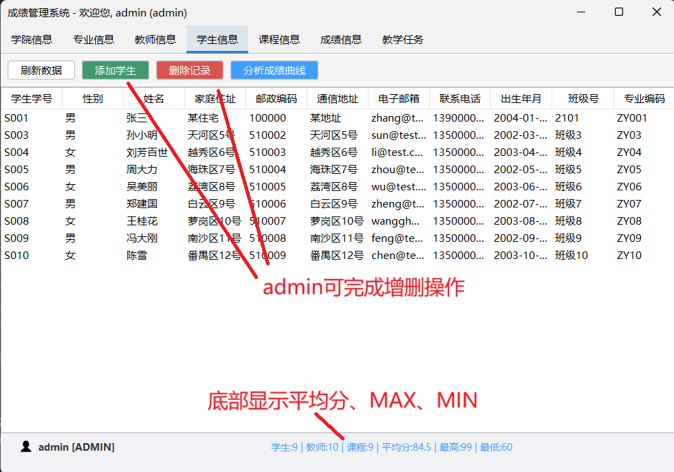
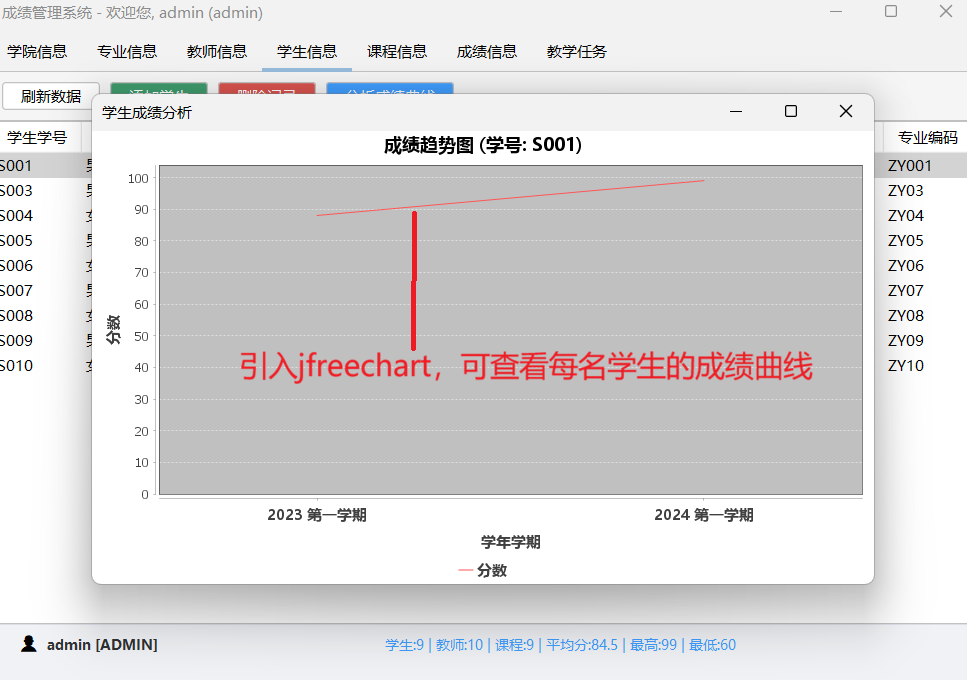
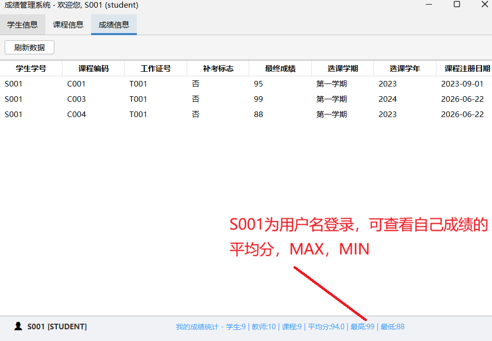
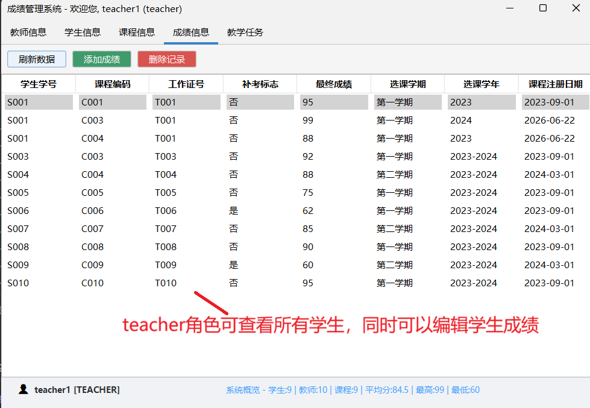

# 成绩管理信息系统 (JDBC版)

## 项目简介
本项目是一个基于 Java、MySQL 和 JDBC 的成绩管理系统。实现了学生、教师、教务管理人员三种角色的权限控制。

## 技术栈
- 语言: Java (JDK 8+)
- 数据库: MySQL 5.7
- 技术: JDBC, Maven

## 数据库设计 (7张表)
1. `users`: 用户账号与角色 (admin, teacher, student)
2. `departments`: 学院信息
3. `classes`: 班级信息
4. `students`: 学生详细信息
5. `teachers`: 教师详细信息
6. `courses`: 课程信息
7. `grades`: 成绩信息 (核心业务表)

## 权限说明
- **学生 (student)**: 登录系统，查看自己的成绩。
- **教师 (teacher)**: 登录系统，管理(增删改查)自己负责课程的学生成绩，查看课程信息。
- **教务人员 (admin)**: 拥有最高权限，管理用户、基础信息(学院/班级/教师/学生)以及所有成绩。

## 如何运行
1. 执行 `sql/init.sql` 脚本创建数据库。
2. 将 `mysql-connector-java.jar` 放入项目环境路径。
3. 修改 `src/com/grade/util/DBUtil.java` 中的数据库密码。
4. 运行 `src/com/grade/Main.java`。

## 默认账号
- 管理员: `admin` / `123456`
- 教师: `teacher1` / `123456`
- 学生: `S001` / `123456`

